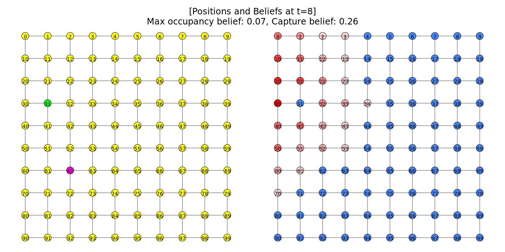

# Multi-robot Efficient Search Path Planning
Implementation of [MILP Models for Multi-Robot Non-Adversarial Search](https://arxiv.org/abs/2011.12480) paper.

*Important Note*: No parts of the code were borrowed or used from the [author's implementation](https://github.com/basfora/milp_mespp) whatsoever. The entire project has been built from scratch with references duly credited in the [Appendix](#appendix).

You can find my blog post describing the technical details [here](https://trunc8.github.io/2021/04/01/pr-mespp).

## Demo
  
*Searchers(green) and target(red) just before capture*

  
*Capture event(pink)*

## How to Run
1. [Obtain Gurobi license](https://www.gurobi.com/downloads/end-user-license-agreement-academic/). There is a free academic license which is sufficient for our needs.
1. [Install Gurobi(for Linux)](http://abelsiqueira.github.io/blog/installing-gurobi-7-on-linux/)
1. `git clone https://github.com/trunc8/multirobot-efficient-search-path-planning.git`
1. `cd multirobot-efficient-search-path-planning`
1. `pip install -r requirements.txt`
1. `python3 code/main.py`

You can find the results in the `results` directory

## Appendix
### References
#### igraph debugging
- [Node labels in igraph](https://stackoverflow.com/questions/37793254/python-igraph-infomap-node-labels-on-graph)
- [Plotting as grid graph and saving](https://igraph.org/python/doc/tutorial/visualisation.html)
- [Generating lattice graph](https://igraph.org/python/doc/tutorial/generation.html)
- [Lots of stuff from here](https://igraph.org/python/doc/tutorial/tutorial.html)
- [Multi-dimensional numpy decision variable](https://www.gurobi.com/documentation/9.1/refman/py_model_addmvar.html)
- [Suppress gurobi optimizer output](https://support.gurobi.com/hc/en-us/articles/360044784552-How-do-I-suppress-all-console-output-from-Gurobi-)
- [Finding neigborhood](https://igraph.org/python/doc/tutorial/analysis.html#vertices-and-edges)
- [Adding title to igraph](https://stackoverflow.com/questions/18250684/add-title-and-legend-to-igraph-plots)
- [Adding multiple subgraphs to igraph](https://igraph.discourse.group/t/how-to-draw-multiple-subplots-on-cairo-surface/423)
- [Copy an igraph](https://stackoverflow.com/questions/29911852/python-duplicate-a-python-igraph)

#### gurobi
- [Understanding MIP](https://www.gurobi.com/resource/mip-basics/)
- [When is update model required](https://groups.google.com/g/gurobi/c/Lo_wnSlPBMQ)
- [LinExp Error on applying quicksum to matrix variables](https://support.gurobi.com/hc/en-us/community/posts/360075084112-Unsupported-Type-for-LinExpr-Argument)

#### python
- [Randomly choose from a list](https://stackoverflow.com/questions/306400/how-to-randomly-select-an-item-from-a-list)
- [Convert int to hexadecimal with 0 padding](https://stackoverflow.com/questions/2269827/how-to-convert-an-int-to-a-hex-string)

### Algorithm design decisions
#### Networkx vs iGraph
iGraph is best suited for our purpose based on [this Reddit discussion](https://www.reddit.com/r/Python/comments/4g9lp0/opinions_on_igraph_vs_netwrokx_in_python/d2i0r45?utm_source=share&utm_medium=web2x&context=3)

>Use NetworkX for smaller networks and dynamic networks. NetworkX is pure Python, well documented and handles changes to the network gracefully.  
iGraph is more performant in terms of speed and ram usage but less flexible for dynamic networks. iGraph is a C library with very smart indexing and storage approaches so you can load pretty large graphs in ram. The index needs to be updated whenever the graph changes, so dynamic graphs incur a lot of overhead.

### Additional comments
Linear programming is P while integer programming is NP-hard.

## Author(s)

* **Siddharth Saha** - [trunc8](https://github.com/trunc8)

Created with :heart: by <a href="https://www.linkedin.com/in/sahasiddharth611/">Siddharth</a>

